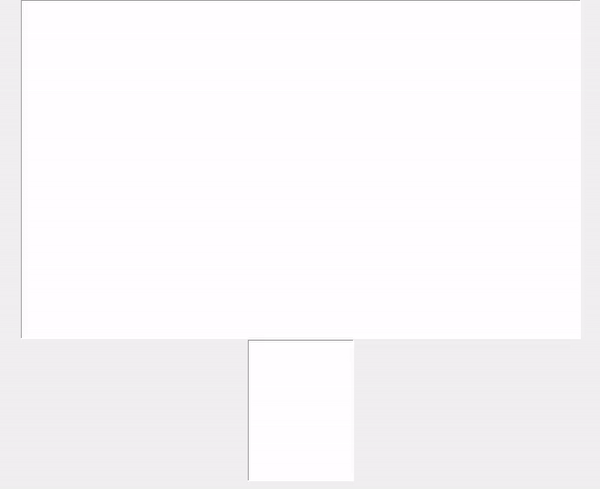

# AI Autocorrect System🤖

[](https://www.python.org/)


## Table of Contents
- [Demo](#demo)
- [Overview](#overview)
- [Features](#features)
- [About the Corpus](#about-the-corpus)
- [Usage](#how-to-use)
- [Limitations](#limitations)

## Demo:



Here is a **short, clean, and simple README** — ready to copy-paste into GitHub 👇


# 🤖 AI Autocorrect System

A Python application that automatically detects and corrects spelling mistakes while typing.
It compares typed words with a dictionary and suggests the most probable correct word.


## 📌 Features

* Real-time spelling correction
* Suggests similar words using **edit distance**
* Chooses best word using **word frequency (probability)**
* Simple GUI built with **Tkinter**
* Auto-replace wrong word when space is pressed
* Shows suggestion list after typing stops


## 🧠 How It Works

The system compares the typed word with dictionary words by checking:

* Missing letters → `speling → spelling`
* Extra letters → `spelliing → spelling`
* Wrong letters → `recieve → receive`
* Swapped letters → `spelilng → spelling`

Then it selects the most common matching word from the dataset.


## 📂 Corpus (Dictionary)

The accuracy depends on the dataset (corpus).
It contains cleaned English words collected from books, articles, and dictionaries.

Bigger and cleaner corpus = better correction.


## ▶️ How to Run

```bash
pip install numpy editdistance
python main_script.py
```

Then:

1. A window opens
2. Start typing
3. Suggestions appear automatically
4. Click suggestion or press space to accept correction


## ⚠️ Limitations

* Works only for English words
* Does not understand sentence meaning
* May change correct words sometimes
* Slang or new words may not be detected


